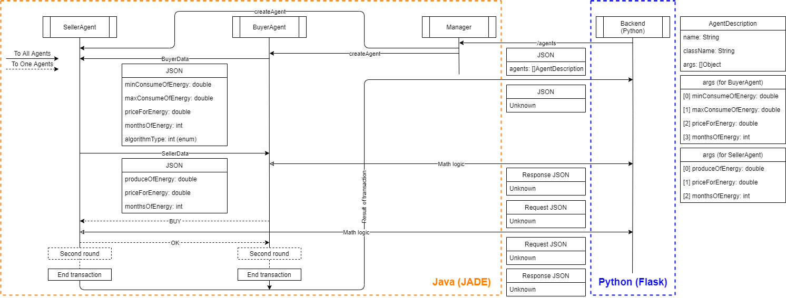

# AENet-agents - agent system for AENet project

## Usage
1. Build - You have 2 options available:
   - Build with docker container - `docker build -t aenet-agents .`
   - Build with maven - `mvn assembly`
2. Startup:
    - Docker - `docker run aenet-agents:latest`
    - Maven - `java -jar <path to assembled jar>`
3. Access to manager with gRPC requests with `agents.proto` from repo

Where buyer args is: `[maxConsumeOfEnergy, minConsumeOfEnergy, priceForEnergy, monthsOfEnergy]`

And seller args is: `[produceOfEnergy, minEnergyForContract, priceForEnergy, monthsOfEnergy]`

4. Get response to your server

## Documentation

### Diagram of working with backend python service

### Other documentation is available in `doc` folder

